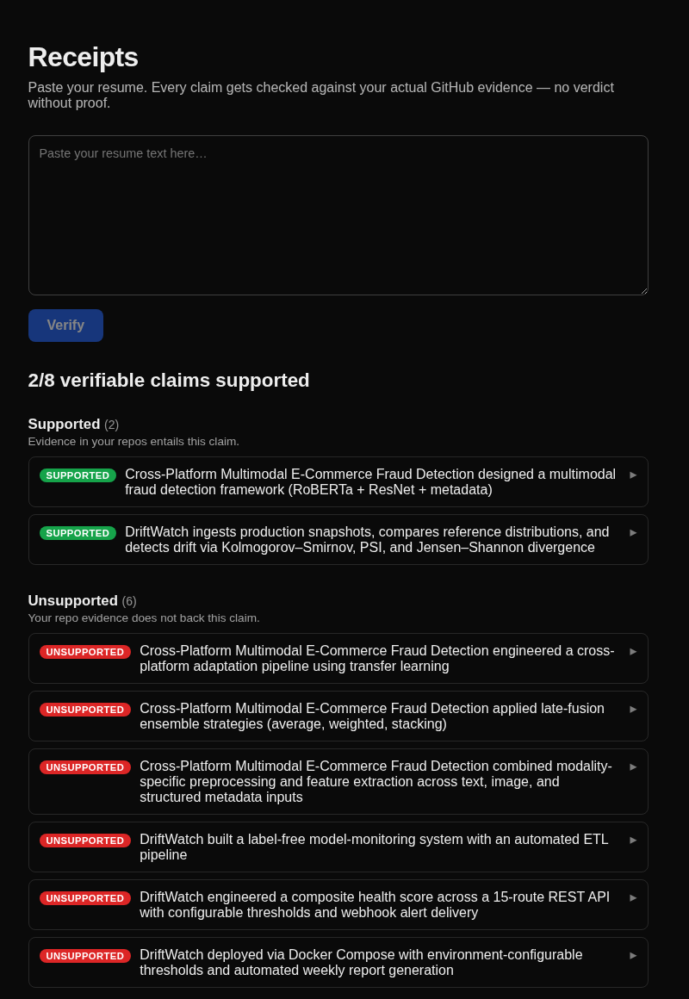

# Receipts

AI resume tools hallucinate achievements. Receipts verifies every resume claim against your actual GitHub evidence — **supported / partial / unsupported**, with links to proof.



## Why this exists

An AI resume tool nearly shipped a fabricated metric onto my resume. I caught it, then built the tool that catches it automatically — and ran it on myself first.

Receipts is the first artifact of a simple design principle: **the LLM narrates only what deterministic evidence supports.** The LLM decomposes your resume into atomic claims; everything after that — retrieval, entailment, verdicts — is local, deterministic, and auditable.

## How it works

1. **Evidence extraction** — your public GitHub repos are fetched via the REST API: metadata, languages, dependency manifests, READMEs, commit stats. Normalized into evidence chunks with URLs (currently 10 repos, 182 chunks).
2. **Claim decomposition** — an LLM splits resume bullets into atomic claims, each typed: `tech` (verifiable from code), `quantitative` or `soft` (code can't decide these → honestly flagged **unverifiable**, not guessed).
3. **Verification** — evidence chunks are embedded locally (BAAI/bge-m3); the top matches per claim go through a local NLI model (DeBERTa-v3-base-mnli-fever-anli) for entailment. A deterministic dependency-manifest check can also prove a named package is really used.
4. **Verdicts** — `supported` (evidence entails the claim), `partial` (the core is supported, the stated extent is not), `unsupported`, `no_evidence` (no repo for that project), `unverifiable`. Every verdict links to its evidence.

A claim like *"monitors hundreds of production models in real time"* gets a second NLI pass on its weakened core (*"monitors models"*): core entailed but full claim not → **partial**, with both halves shown.

## Evaluation

60 hand-labeled claims across my own public repos: 20 true, 20 stretched, 20 fabricated. Labels were written by hand before any tuning; the labeled set, provenance notes, and results are in [`data/eval/`](data/eval/).

**Confusion matrix** (hand label × Receipts verdict):

| label \ verdict | supported | partial | unsupported |
|---|---|---|---|
| true (n=20) | 19 | 0 | 1 |
| stretched (n=20) | 3 | 9 | 8 |
| fabricated (n=20) | 0 | 0 | 20 |

| verdict | precision | recall |
|---|---|---|
| supported | 0.86 | 0.95 |
| partial | 1.00 | 0.45 |
| unsupported | 0.69 | 1.00 |

On this eval set: **20/20 fabricated claims were flagged unsupported**, 19/20 true claims verified, and overall accuracy against expected verdicts was 0.80 (48/60).

### Baseline: what an unconstrained LLM resume-writer does

I gave the same LLM the same repo evidence, prompted as a resume writer with no honesty constraints, and ran its output back through Receipts ([`eval/baseline.py`](eval/baseline.py), single run):

- 1 of its 18 checkable claims was **unsupported**, 1 was **partial** — even with accurate READMEs as its only input.
- 6 more claims were **unverifiable** — including one *invented* quantitative validation claim ("significantly reduces bug reintroduction rates in controlled A/B testing scenarios") describing testing that has never happened.

That invented A/B-testing claim is the failure mode this project exists for: it sounds empirical, a recruiter can't check it, and no code evidence can support it. Receipts won't call it supported.

## Limitations (read these)

- **Stretched claims are hard.** Partial recall is 0.45: stretched claims are reliably kept out of `supported` (17/20), but often land in `unsupported` rather than `partial`.
- **Self-reported evidence loop.** A repo's own README asserting an exaggeration can make that exaggeration verify as supported (3/20 stretched claims passed this way). READMEs are claims too; weighting them below code-derived evidence is roadmap.
- **The eval is n=60, one person's repos, labeled by the author.** Real numbers, small world. The labels were written before the verdict logic was finalized, but the partial-verdict fix was developed against this same set — so 0.80 is dev-set accuracy, not held-out accuracy.
- Quantitative and soft claims are never verified from code — `unverifiable` is an honest verdict here, not a failure.

## Run it

```bash
# backend (FastAPI, port 8000) — needs OPENAI_API_KEY in .env for decomposition
pip install fastapi uvicorn requests numpy sentence-transformers transformers torch
uvicorn api.main:app --port 8000

# frontend (Next.js, port 3000)
cd web && npm install && npm run dev
```

Paste your resume at `localhost:3000`. Evidence fetching is an offline step: `python ingest/fetch_github.py <username>`.

## Roadmap (deliberately not built yet)

Grounded bullet generation, AST-level skill detection, multi-user/auth, LinkedIn and other evidence sources, gap-analysis coaching, README-vs-code evidence weighting.

---

*Disclosure, in the spirit of the project: this README's prose was drafted by an AI assistant at the author's request, then every number in it was verified against the committed eval data — see [`data/eval/results.json`](data/eval/results.json) and [`data/eval/baseline_results.json`](data/eval/baseline_results.json).*
